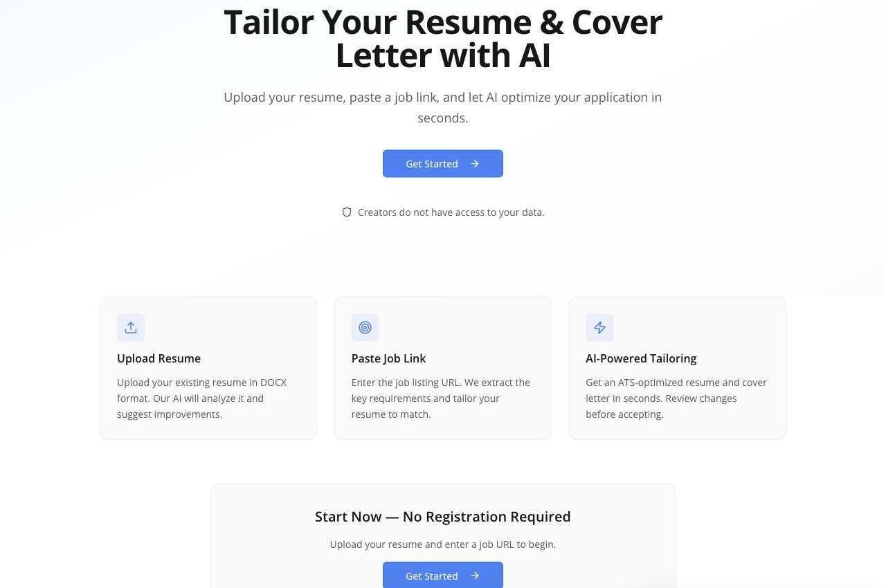
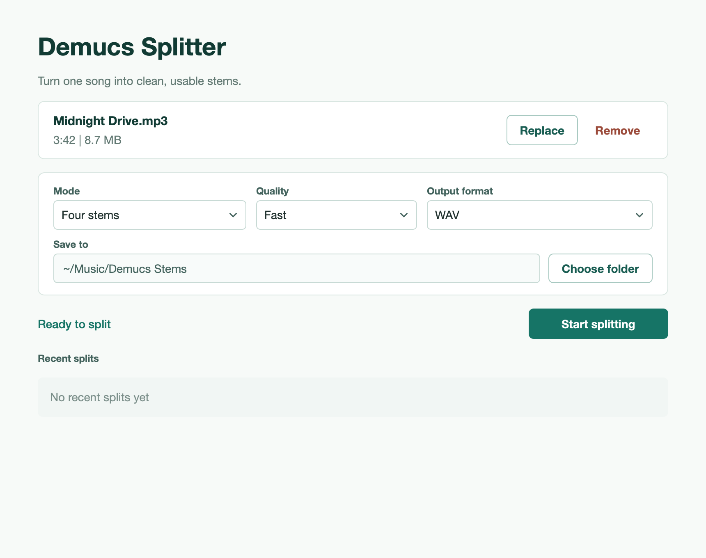

# Hi, I'm Evgenii 👋

**AI Product Builder · Senior Product Manager**

I turn ambiguous user problems into working AI products — from discovery and rapid prototyping to LLM integration, security, and deployment.

📍 Porto, Portugal

## Projects

### [Morningfeed Bot](https://github.com/shilovpm/morningfeed_bot)

A self-hosted Telegram bot that turns posts from selected channels into concise, scheduled AI digests.

Currently used by **34 users** with **21 active digests**.

- Supports multiple daily and weekly digests
- Collects posts from public Telegram channels
- Handles timezones, retries, rate limits, and overlapping runs
- Uses token-aware chunking and model fallback
- Tracks runs and usage in PostgreSQL
- Uses Telegram as the complete product interface — an unused web dashboard was deliberately removed

**Built with:** TypeScript, Node.js, Telegram Bot API, PostgreSQL, Prisma, and OpenAI

[Open Morningfeed Bot on Telegram →](https://t.me/morningfeed_bot)

---

### [Job Offer Reviews Agent System](https://github.com/shilovpm/joboffer-reviews-agent-system)

A multi-agent Codex research system for Product-focused employer evaluation. It uses an orchestrator → Collector → Analyzer architecture, role-based reasoning, structured context handoffs, adaptive evidence sampling, and deterministic Python validation.

Built after reviewing public employer-research and career-agent implementations and identifying gaps in Product-specific evidence handling, multi-source validation, context isolation, incremental research, and auditability.

**Focus:** Agent Skills · agent orchestration · subagents · reasoning routing · context engineering · Python · evidence systems

---

### [WEST time and timer](https://github.com/shilovpm/west-time-and-timer)

A native macOS utility combining a persistent countdown timer with world clocks and desktop widgets.

- Searches the full macOS IANA time-zone database, including cities and seasonal designations such as CET/CEST, EET/EEST, and WET/WEST
- Shows each clock's live difference from the Mac time zone and handles DST automatically
- Shares one deadline-based timer between the app and interactive WidgetKit widgets
- Includes small, medium, and large clock widgets, plus a small timer widget
- Supports 11 interface languages and system light/dark appearance
- Works fully offline and ships as a self-contained Apple Silicon DMG

**Built with:** Swift, SwiftUI, WidgetKit, App Intents, UserNotifications, and XCTest

---

### [Vakanzo](https://github.com/shilovpm/Vakanzo)

A self-hosted AI assistant for tailoring resumes and cover letters to specific job vacancies.

- Compares a resume with a vacancy and explains strengths and gaps
- Rewrites content without intentionally inventing experience
- Shows before/after changes and ATS keywords for human review
- Generates downloadable DOCX documents
- Supports English, Spanish, Russian, Portuguese, and Belarusian
- Includes privacy controls, anonymous sessions, rate limiting, and SSRF protection

**Built with:** TypeScript, React, Express, PostgreSQL, Drizzle ORM, and OpenAI

---

### [Demucs Splitter for macOS](https://github.com/shilovpm/demucs_UI_app)

A native macOS interface built on top of the open-source Demucs music source separation model.

- Drag-and-drop audio import
- Configurable separation modes and output formats
- Live progress and recovery states
- Apple Silicon acceleration
- Distributed as a standalone DMG with bundled dependencies

**Built with:** Python, PySide6, PyTorch, Demucs, and FFmpeg

## Let's connect

- [LinkedIn](https://www.linkedin.com/in/shilovevgenii)
- [Portfolio](https://evgenii-shilov.replit.app)
- [Telegram](https://t.me/shilov_jenia)
